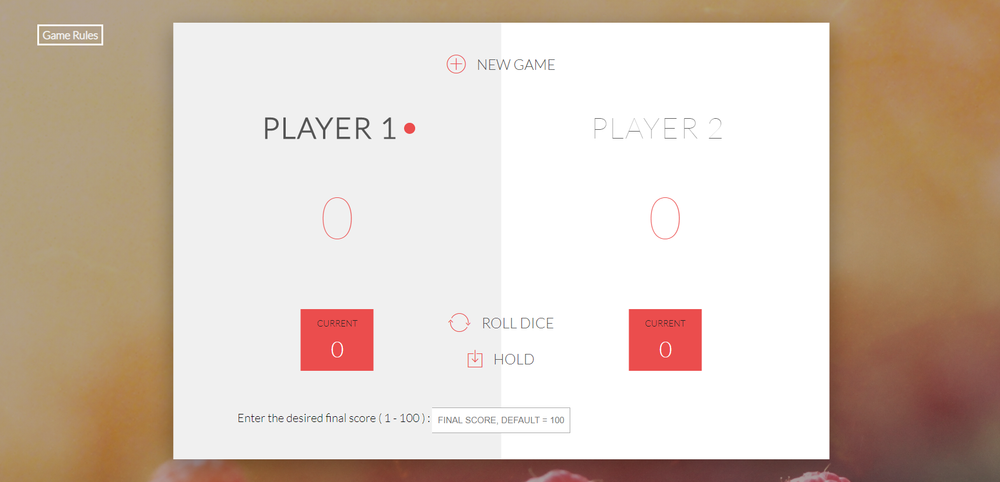

# Cube-game
Simple JavaScript game based on cube dice

It's a practice on some javaScript main concepts. 
It's part of a JavaScript course.

<h4>Screenshot for the game</h4>

<h4># Game Rules :</h4>
 - The game has 2 players, playing in rounds. 
 - In each turn, a player rolls the dices as many times as he whishes. 
 - Each result get added to his ROUND score. 
 - BUT, if the player rolls a 1 in either, all his ROUND score gets lost AND it's the next player's turn. 
 - The player can choose to 'Hold', which means that his ROUND score gets added to his GLBAL score. 
 - After that it's the next player's turn. 
 - The first player to reach the win score (default is 100) points on GLOBAL score wins the game. 
 - Note, you can change the final score as you wish between ( 1 - 100 ), default will be 100.
